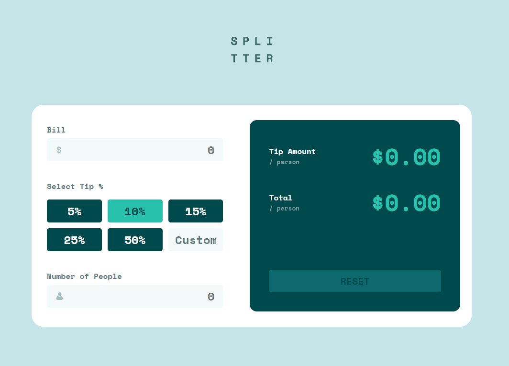

# Frontend Mentor - Tip calculator app solution

This is a solution to the [Tip calculator app challenge on Frontend Mentor](https://www.frontendmentor.io/challenges/tip-calculator-app-ugJNGbJUX). Frontend Mentor challenges help you improve your coding skills by building realistic projects.

## Table of contents

- [Overview](#overview)
  - [The challenge](#the-challenge)
  - [Screenshot](#screenshot)
  - [Links](#links)
- [My process](#my-process)
  - [Built with](#built-with)
  - [What I learned](#what-i-learned)
  - [Continued development](#continued-development)
  - [Useful resources](#useful-resources)
- [Author](#author)

## Overview

### The challenge

Users should be able to:

- View the optimal layout for the app depending on their device's screen size
- See hover states for all interactive elements on the page
- Calculate the correct tip and total cost of the bill per person

### Screenshot

### Links

- Solution URL: [Github Repo](https://github.com/morauszkia/fm-tip-calculator)
- Live Site URL: [Github Page](https://morauszkia.github.io/fm-tip-calculator/)

## My process

### Built with

- [Vue.js](https://vuejs.org/) - JS framework
- Reactive store
- [vue-debounce](https://www.npmjs.com/package/vue-debounce) - For debouncing inputs
- Semantic HTML5 markup
- CSS custom properties
- Scoped styles
- Flexbox
- CSS Grid
- Mobile-first workflow
- [Vite](https://vite.dev) - Build Tool

### What I learned

Using Vue.js did not come naturally, and for example, I had to look up ways to use `v-model` with custom components, and how to validate custom components. I decided to use a store to be able to access state more convenient.

### Continued development

In the future it would be great, if I could rebuild this using some other framework. As I am most familiar with React, using Svelte would be a nice challenge. Also, in the future I would like to try some form validation library and also Pinia for state management.

### Useful resources

- [Vue docs](https://vuejs.org/guide/introduction.html)
- [Vite docs](https://vite.dev/guide/assets.html) - These helped me a lot, especially with static asset handling and deployment.concept.

## Author

- Frontend Mentor - [@mantis](https://www.frontendmentor.io/profile/morauszkia)
- X - [@mantis_hu86](https://x.com/mantis_hu86)
- Github -[@mantis](https://github.com/morauszkia)
- LinkedIn - [András Morauszki](https://www.linkedin.com/in/andras-morauszki/)
